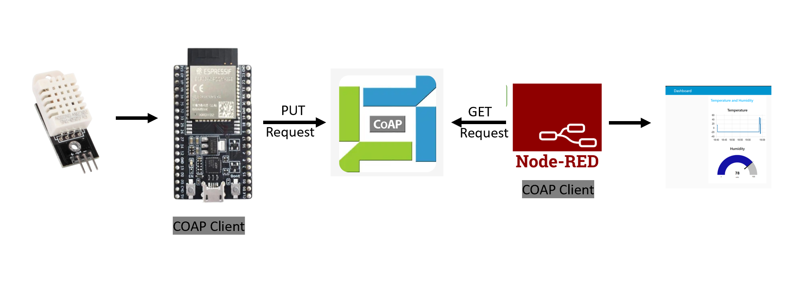
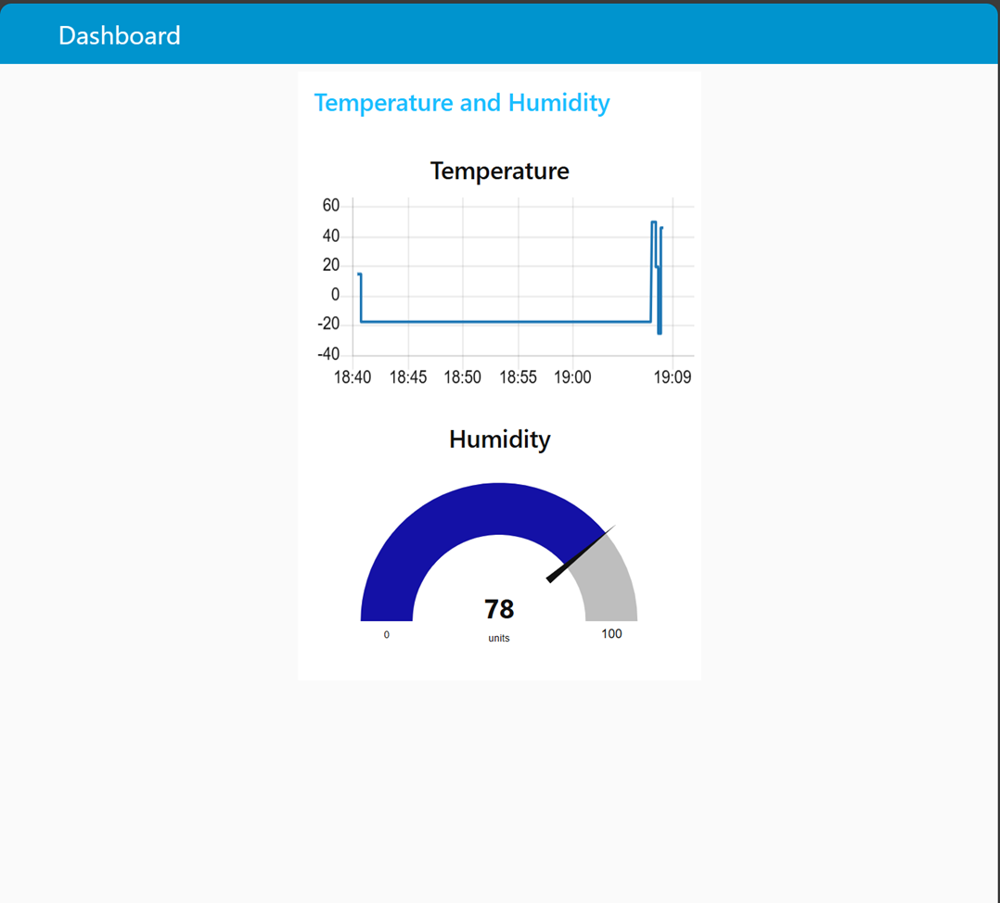

# Send DHT22 data with ESP32 using COAP to Node-Red Dashboard


## Flow diagram of the Project



### Step 1: Install the Required Libraries
- Open an Arduino IDE --> Tools --> Manage Libraries
- Search and install the following libraries
    ```
    WiFi
    CoAP simple library
    DHT sensor library for ESPx
    ```

### Step 2: Hardware Schematic
- Four pin DHT22


### Step 3: Running the program
- Copy the code to the Arduino IDE
- Setup the Board and Port
- Connect the ESP32 to the USB port of the computer
- Upload the code
- Monitor the values in the Serial monitor

### Step 4: Setup the Node-RED flow

- Open Node-RED URL in the browser
- Click on Menu --> Manage Palette
- Search for "node-red-dashboard" and install it. 
- Import the flow using the following code

```
[
    {
        "id": "6f6cfe9e5b6c8c25",
        "type": "tab",
        "label": "Flow 1",
        "disabled": false,
        "info": "",
        "env": []
    },
    {
        "id": "3a5b44eda3c83db2",
        "type": "inject",
        "z": "6f6cfe9e5b6c8c25",
        "name": "Trigger",
        "props": [
            {
                "p": "payload"
            },
            {
                "p": "topic",
                "vt": "str"
            }
        ],
        "repeat": "",
        "crontab": "",
        "once": false,
        "onceDelay": 0.1,
        "topic": "",
        "payload": "\"\"",
        "payloadType": "str",
        "x": 110,
        "y": 260,
        "wires": [
            [
                "d9840deca5d596a5"
            ]
        ]
    },
    {
        "id": "d9840deca5d596a5",
        "type": "coap request",
        "z": "6f6cfe9e5b6c8c25",
        "method": "GET",
        "confirmable": true,
        "observe": false,
        "multicast": false,
        "multicastTimeout": 20000,
        "url": "coap://172.26.1.212:5683/example_data",
        "content-format": "text/plain",
        "raw-buffer": false,
        "name": "Get Sensor Data",
        "x": 310,
        "y": 260,
        "wires": [
            [
                "372222e6aef9a851"
            ]
        ]
    },
    {
        "id": "372222e6aef9a851",
        "type": "json",
        "z": "6f6cfe9e5b6c8c25",
        "name": "",
        "property": "payload",
        "action": "",
        "pretty": false,
        "x": 510,
        "y": 260,
        "wires": [
            [
                "66b5d59ae7edc9ff"
            ]
        ]
    },
    {
        "id": "66b5d59ae7edc9ff",
        "type": "function",
        "z": "6f6cfe9e5b6c8c25",
        "name": "function 1",
        "func": "// Parse the sensor data\nconst sensorData = msg.payload;\n\n// Create temperature message\nconst tempMsg = {...msg};\ntempMsg.payload = sensorData.temperature;\ntempMsg.topic = \"temperature\";\n\n// Create humidity message  \nconst humidityMsg = {...msg};\nhumidityMsg.payload = sensorData.humidity;\nhumidityMsg.topic = \"humidity\";\n\n// Return [temperature, humidity]\nreturn [tempMsg, humidityMsg];\n",
        "outputs": 2,
        "timeout": 0,
        "noerr": 0,
        "initialize": "",
        "finalize": "",
        "libs": [],
        "x": 660,
        "y": 260,
        "wires": [
            [
                "850521544d9c6e76",
                "15d422706966ab74"
            ],
            [
                "ff799a345c46033e",
                "acd985911175d002"
            ]
        ]
    },
    {
        "id": "850521544d9c6e76",
        "type": "debug",
        "z": "6f6cfe9e5b6c8c25",
        "name": "Temperature",
        "active": true,
        "tosidebar": true,
        "console": false,
        "tostatus": false,
        "complete": "payload",
        "targetType": "msg",
        "statusVal": "",
        "statusType": "auto",
        "x": 930,
        "y": 200,
        "wires": []
    },
    {
        "id": "ff799a345c46033e",
        "type": "debug",
        "z": "6f6cfe9e5b6c8c25",
        "name": "humidity",
        "active": true,
        "tosidebar": true,
        "console": false,
        "tostatus": false,
        "complete": "payload",
        "targetType": "msg",
        "statusVal": "",
        "statusType": "auto",
        "x": 920,
        "y": 320,
        "wires": []
    },
    {
        "id": "acd985911175d002",
        "type": "ui_gauge",
        "z": "6f6cfe9e5b6c8c25",
        "name": "",
        "group": "2c7e796f04eb88fb",
        "order": 0,
        "width": 0,
        "height": 0,
        "gtype": "gage",
        "title": "Humidity",
        "label": "units",
        "format": "{{value}}",
        "min": 0,
        "max": "100",
        "colors": [
            "#7d77a6",
            "#49479e",
            "#1411a6"
        ],
        "seg1": "33",
        "seg2": "66",
        "diff": false,
        "className": "",
        "x": 920,
        "y": 380,
        "wires": []
    },
    {
        "id": "15d422706966ab74",
        "type": "ui_chart",
        "z": "6f6cfe9e5b6c8c25",
        "name": "",
        "group": "2c7e796f04eb88fb",
        "order": 1,
        "width": 0,
        "height": 0,
        "label": "Temperature",
        "chartType": "line",
        "legend": "false",
        "xformat": "HH:mm",
        "interpolate": "linear",
        "nodata": "",
        "dot": false,
        "ymin": "",
        "ymax": "",
        "removeOlder": 1,
        "removeOlderPoints": "",
        "removeOlderUnit": "3600",
        "cutout": 0,
        "useOneColor": false,
        "useUTC": false,
        "colors": [
            "#1f77b4",
            "#aec7e8",
            "#ff7f0e",
            "#2ca02c",
            "#98df8a",
            "#d62728",
            "#ff9896",
            "#9467bd",
            "#c5b0d5"
        ],
        "outputs": 1,
        "useDifferentColor": false,
        "className": "",
        "x": 930,
        "y": 140,
        "wires": [
            []
        ]
    },
    {
        "id": "2c7e796f04eb88fb",
        "type": "ui_group",
        "name": "Temperature and Humidity",
        "tab": "1f567676a77ebe47",
        "order": 1,
        "disp": true,
        "width": 6,
        "collapse": false,
        "className": ""
    },
    {
        "id": "1f567676a77ebe47",
        "type": "ui_tab",
        "name": "Dashboard",
        "icon": "dashboard",
        "disabled": false,
        "hidden": false
    },
    {
        "id": "ae378a66689caa55",
        "type": "global-config",
        "env": [],
        "modules": {
            "node-red-contrib-coap": "0.8.0",
            "node-red-dashboard": "3.6.6"
        }
    }
]
```
- Deploy the flow
- Navigate to the following URL and modify the <your IP address>. For example http://localhost:1880/ui
```
http://<your IP address>:1880/ui
```
- Monitor the values in the Dashboard as below
  
